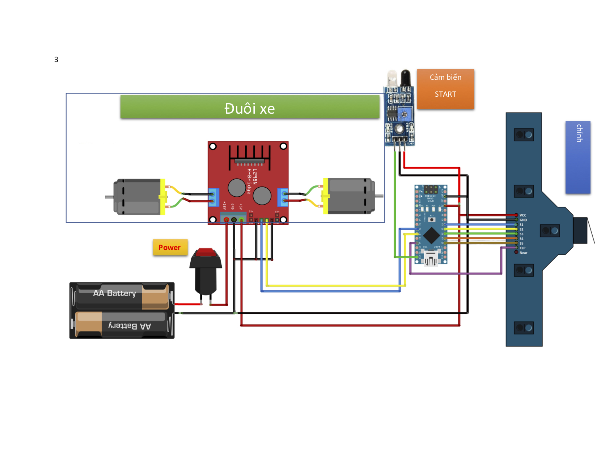
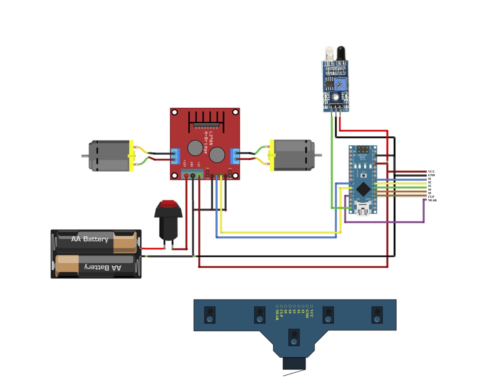

# Xe Dò Line UTC2 -- Đại Học Giao Thông Vận Tải - Phân Hiệu Tại TP.HCM | Mã Tuyển Sinh: GSA

<p align="center">
  
</p>

Đi line tự động dùng Arduino Nano kết hợp 5 mắt đọc cảm biến dò line

## Phần Mềm Cần Thiết

* Arduino IDE | [Windows](https://downloads.arduino.cc/arduino-1.8.12-windows.exe) | [MacOS](https://downloads.arduino.cc/arduino-1.8.12-macosx.zip) | [Linux](https://downloads.arduino.cc/arduino-1.8.12-linux64.tar.xz)
* Phần mềm giải nén tập tin * *.zip*

## Sơ Đồ Kết Nối Phần Cứng




## Sân Thi Đấu [Download](resources/docs/SANTHIDAU_2.pdf)


## Cài đặt và thiết lập

1. Khởi động Arduino IDE lần đầu tiên để cài các driver và thư viện cần thiết

2. Tải xuống mã nguồn đầy đủ của chương trình [tại đây](https://github.com/spiderock98/XeDoLineUTC2/archive/master.zip) 

3. Giải nén file *XeDoLineUTC2-master.zip* vừa tải về

4. Khởi động Arduino IDE chọn *File >> Open* và trỏ đường dẫn đến file *[XeDoLineUTC2-master.ino](XeDoLineUTC2-master.ino)* trong thư mục *XeDoLineUTC2-master* vừa xả nén

5. Tại giao diện phần mềm ArduinoIDE. Chọn board:  *Tools >> Board >> **Arduino Nano***

6. Chọn loại vi xử lý: *Tools >> Processor >> **ATmega328P (Old Bootloader)***

7. Chọn cổng giao tiếp: *Tools >> Port >> COMxx* 

8. Nạp chương trình đầu tiên từ PC xuống Arduino: *Sketch >> Upload*

9. Chờ phần mềm báo *Done Uploading* là đã nạp thành công code xuống ArduinoNano

## Cân Chỉnh 5 Mắt Cảm Biến Dò Line

```
Chương trình sẽ tự lưu lại các giá trị cảm biến sau khi cân chỉnh và tự động nạp lại trong những lần khởi động kế tiếp
Do đó chỉ cần thực hiện lại quy trình này khi xe có dấu hiệu hay trượt mất line do điều kiện ánh sáng ngoài trời thay đổi
```

### Vào chế độ cân chỉnh
* Tắt nguồn động cơ xe
* Cắm cáp kết nối ArduinoNano và PC
* Nhấn và giữ nút cân chỉnh - (nút nhấn đặt phía trước cảm biến dò line)
* *vẫn nhấn giữ nút cân chỉnh* đồng thời nhấn vào biểu tượng kính lúp  ở góc trên bên phải phần mềm ArduinoIDE để bật màn hình Serial Monitor
* Thả nút cân chỉnh khi vào đến màn hình **Welcome Screen**

### Cân chỉnh cảm biến theo sa hình
* Quan sát Serial Monitor và làm theo hướng dẫn
* Khi đạt được giá trị cảm biến ổn định thì nhấn giữ nút cân chỉnh để xác nhận
* Tiếp tục cân cho đến hết S5
* Rút cáp kết nối

### Giải Thích Các Hàm
```
void followLine() {
    while (1) {
        ...
        else if (port == 0) {
          onStop();
          break;
        }
        else if ((port & B00001) == 0) {
          leftScript = 0; // tự động rẽ PHẢI
          onStop();
          break; // thoát khỏi vòng lặp
        }
        else if ((port & B10000) == 0 ){
          leftScript = 1; // tự động rẽ TRÁI
          onStop();
          break; // thoát khỏi vòng lặp
        }
    }
}
```
#### Hàm đi line
* vòng lặp vô tận (infinity loop)
* liên tục bắt các sự kiện để dò theo line
#### Điều kiện thoát - `break`
* **S1** hoặc **S5** nằm trên line trắng. Không quan tâm **S2 S3 S4**
* trước khi thoát kéo cờ `leftScript` lên `0` hoặc `1` để xe tự phân biệt đội A hay đội B

```
if (port==B10111)
    onLeft1();
```
##### Sự kiện
* đánh lái sang **PHẢI**
* khi **S2** nằm trên line trắng (lệch **TRÁI**)
* đồng thời **S1 S3 S4 S5** nằm trên line đen
##### Điều kiện thoát
* **S2** không còn nằm trên line trắng
* Gặp các điều kiện khác trong `followLine(){ ... }`

```
if (port==B11101)
    onRight1();
```
##### Sự kiện
* đánh lái sang **TRÁI**
* khi **S4** nằm trên line trắng (lệch **PHẢI**)
* đồng thời **S1 S2 S3 S5** nằm trên line đen
##### Điều kiện thoát
* **S4** không còn nằm trên line trắng
* Gặp các điều kiện khác trong `followLine(){ ... }`

```
if ((port==B11011) || (port==B11111))
    onStraight();
```
##### Sự kiện
* đi **THẲNG** bằng cách cân bằng 2 động cơ
* khi **S3** nằm trên line trắng. Đồng thời **S1 S2 S4 S5** nằm trên line đen
* khi cả 5 cảm biến cùng nằm trên line đen (nhiễu các trường hợp đặc biệt)
##### Điều kiện thoát
* Gặp các điều kiện khác trong `followLine(){ ... }`

```
void turnLeft(){
  while ((adc2port() & B00010) != 0){
    analogWrite(rightmotor, defaultValue-5);
    digitalWrite(leftmotor, 0);
  }
  onStop();
}
```
#### Hàm xử lý ngã ba (rẽ trái)
* vòng lặp vô tận (infinity loop)
* động cơ trái dừng, động cơ phải hoạt động
#### Điều kiện thoát vòng lặp - `break`
* động cơ quay đến khi **S4** nằm trong line trắng thì thoát
* sau đó dừng hẳn 2 động cơ `onStop();` 

```
void turnRight(){
  while ((adc2port() & B01000) != 0){
    analogWrite(leftmotor, defaultValue-5);
    digitalWrite(rightmotor, 0);
  }
  onStop();
}
```
#### Hàm xử lý ngã ba (rẽ phải)
* vòng lặp vô tận (infinity loop)
* động cơ phải dừng, động cơ trái hoạt động
#### Điều kiện thoát vòng lặp - `break`
* động cơ quay đến khi **S2** nằm trong line trắng thì thoát
* sau đó dừng hẳn 2 động cơ `onStop();` 

```
void crossRoad(){
  do {
    onStraight();
    delay(2);
  } while (((adc2port() == B11011) || (adc2port() == B10111) || (adc2port() == B11101)) == false);
}
```
#### Hàm xử lý ngã tư
* vòng lặp vô tận (infinity loop)
* 2 động cơ quay đều `onStraight();`
#### Điều kiện thoát vòng lặp - `break`
* 2 động cơ xoay đến khi gặp một trong ba trường hợp | **S3** vào line trắng hoặc **S2** vào line trắng hoặc **S4** vào line trắng

## Built With

* [Arduino Nano](https://store.arduino.cc/usa/arduino-nano) - Main dev hardware
* [Arduino IDE](https://www.arduino.cc/reference/en/) - The compiler for Arduino Nano board

## Nhóm Tác Giả

* **Th.s Võ Thiện Lĩnh**-*Team Leader* - [Facebook](https://www.facebook.com/MR.DUACHUOT)
* **Th.s Lê Mạnh Tuấn**-*Chuyên gia cố vấn cấp cao* - [Facebook](https://www.facebook.com/leemanhtuan)
* **Trần Bách Khoa** - [Facebook](https://www.facebook.com/khoa.tranbach.16)
* **Nguyễn Minh Tiến** - [Facebook](https://www.facebook.com/spiderock98) [GitHub](https://github.com/spiderock98)
* **Nguyễn Minh Trung** - [Facebook](https://www.facebook.com/trungnguyen239)

## Ban Tổ Chức
**Trường Đại học Giao Thông Vận Tải - Phân hiệu tại TP. Hồ Chí Minh** | **Mã tuyển sinh: GSA**
