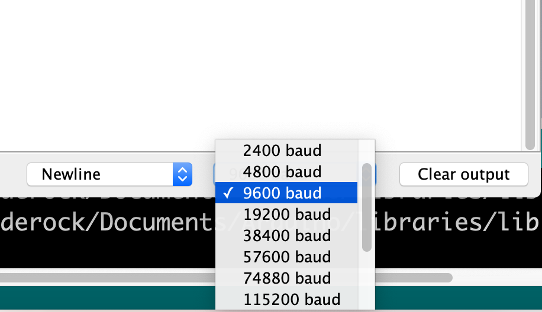

# Xe Dò Line UTC2 - Đại Học Giao Thông Vận Tải - Phân Hiệu Tại TP.HCM | Mã Tuyển Sinh: GSA

<p align="center">
  
</p>

## Phần Mềm Cần Thiết

* Arduino IDE | [Windows](https://downloads.arduino.cc/arduino-1.8.12-windows.exe) | [MacOS](https://downloads.arduino.cc/arduino-1.8.12-macosx.zip) | [Linux](https://downloads.arduino.cc/arduino-1.8.12-linux64.tar.xz)
* Phần mềm giải nén tập tin * *.zip*

## Sơ Đồ Kết Nối Phần Cứng


## Sân Thi Đấu [PDF](resources/docs/SANTHIDAU_2.pdf) | [CorelDRAW](resources/docs/CHINHTHUC_SANTHIDAU_2.cdr)
**Lưu ý khi in lại sân phải giữ đúng tỉ lệ file gốc**

## Cài đặt và thiết lập

1. Khởi động Arduino IDE lần đầu tiên để cài các driver và thư viện cần thiết

2. Tải xuống mã nguồn đầy đủ của chương trình [tại đây](https://github.com/spiderock98/XeDoLineUTC2/archive/master.zip) 

3. Giải nén file *XeDoLineUTC2-master.zip* vừa tải về

4. Khởi động Arduino IDE chọn *File >> Open* và trỏ đường dẫn đến file *[XeDoLineUTC2-master.ino](XeDoLineUTC2-master.ino)* trong thư mục *XeDoLineUTC2-master* vừa xả nén

5. Cắm cáp kết nối ArduinoNano và PC

6. Tại giao diện phần mềm ArduinoIDE. Chọn board:  *Tools >> Board >> **Arduino Nano***

7. Chọn loại vi xử lý: *Tools >> Processor >> **ATmega328P (Old Bootloader)***

8. Chọn cổng giao tiếp: *Tools >> Port >> COMxx* 

9. Nạp chương trình đầu tiên từ PC xuống Arduino: *Sketch >> Upload*

10. Chờ phần mềm báo *Done Uploading* là đã nạp thành công code xuống ArduinoNano


## Cân Chỉnh 5 Mắt Cảm Biến Dò Line

```
Chương trình sẽ tự lưu lại các giá trị cảm biến sau khi cân chỉnh và tự động nạp lại trong những lần khởi động kế tiếp
Do đó chỉ cần thực hiện lại quy trình này khi xe có dấu hiệu hay trượt mất line do điều kiện ánh sáng ngoài trời thay đổi
```

### Vào chế độ cân chỉnh
* Tắt nguồn động cơ xe
* Cắm cáp kết nối ArduinoNano và PC
* Nhấn và giữ nút cân chỉnh - (nút nhấn đặt phía trước cảm biến dò line)
* *Vẫn nhấn giữ nút cân chỉnh* đồng thời nhấn vào biểu tượng kính lúp  ở góc trên bên phải phần mềm ArduinoIDE để bật màn hình Serial Monitor
* Thả nút cân chỉnh khi vào đến màn hình **Welcome Screen**

### Cân chỉnh cảm biến theo sân thi đấu
* Đặt xe vào sân thi đấu
* Quan sát Serial Monitor và làm theo hướng dẫn
* Khi đạt được giá trị cảm biến ổn định thì *nhấn giữ nút cân chỉnh để xác nhận*
* Tiếp tục cân chỉnh cho đến hết cảm biến S5
* Rút cáp kết nối

## FAQs - LƯU Ý QUAN TRỌNG NÈ

* ***KHÔNG ĐƯỢC PHÉP LẮP NGƯỢC CỰC DƯƠNG(+) ÂM(-) CỦA PIN VÀO MẠCH SẠC CŨNG NHƯ MẠCH ĐỘNG CƠ***
* ***PIN NẾU CẮM NGƯỢC CỰC NGAY CẢ KHI CHƯA BẬT NGUỒN CŨNG SẼ GÂY CHÁY NỔ***
* ***SỐ LƯỢNG PIN CÓ HẠN***
* Nếu cắm cáp kết nối Arduino sáng đèn nguồn nhưng không tìm thấy port trong *Tools >> Port >> COMxx* thì tải xuống và cài đặt [Driver mạch nạp CH340C](https://sparks.gogo.co.nz/assets/_site_/downloads/CH34x_Install_Windows_v3_4.zip)
* Nếu cảm biến dò line khi lắp vào có dấu hiệu cong vênh thì dùng kìm bấm linh kiện bấm sát các mối hàn và mắt đọc
* Nếu gặp tình trạng Serial Monitor nhảy ký tự linh tinh hoặc không hiện bất kỳ ký tự nào 
thì chỉnh lại **baudrate ở góc phải bên dưới thành 9600** 
* Trong quá trình UPLOAD nếu ArduinoIDE ném ra lỗi *An error occureed uploading the sketch* thì chọn *Tools >> Verify/Compile* **NHIỀU LẦN** cho đến khi hết lỗi 

## Giải Thích Các Hàm
```
void followLine() {
    while (1) {
        ...
        else if ((port & B00001) == 0) { // S5 rơi vào line trắng
          leftScript = 0; // tự động rẽ PHẢI
          onStop();
          break; // thoát khỏi vòng lặp
        }
        else if ((port & B10000) == 0 ){ // S1 rơi vào line trắng
          leftScript = 1; // tự động rẽ TRÁI
          onStop();
          break; // thoát khỏi vòng lặp
        }
    }
}
```
#### Hàm đi line
* gần như xuyên suốt trong chương trình chính
* chương trình chạy vòng lặp
* liên tục bắt các sự kiện để dò theo line
#### Điều kiện thoát vòng lặp - `break`
* **S1** hoặc **S5** nằm trên line trắng. Không quan tâm **S2 S3 S4**
* trước khi thoát kéo cờ `leftScript` lên `0` hoặc `1` để xe tự phân biệt đội A hay đội B

```
if (port==B10111){
  analogWrite(leftmotor, 40);
  analogWrite(rightmotor, 90);
}
```
##### Sự kiện
* đánh lái sang **TRÁI**
* khi **S2** nằm trên line trắng (lệch **PHẢI**)
* đồng thời **S1 S3 S4 S5** nằm trên line đen

```
if (port==B11101){
  analogWrite(rightmotor, 40);
  analogWrite(leftmotor, 90);
}
```
##### Sự kiện
* đánh lái sang **PHẢI**
* khi **S4** nằm trên line trắng (lệch **TRÁI**)
* đồng thời **S1 S2 S3 S5** nằm trên line đen

```
if (port==B11011)
  analogWrite(rightmotor, 50);
  analogWrite(leftmotor, 50);
```
##### Sự kiện
* đi **THẲNG** bằng cách cân bằng 2 động cơ
* khi **S3** nằm trên line trắng. Đồng thời **S1 S2 S4 S5** nằm trên line đen

```
void turnLeft(){
  while ((adc2port() & B00010) != 0){
    analogWrite(rightmotor, 50);
    digitalWrite(leftmotor, 0);
  }
  onStop();
}
```
#### Hàm xử lý ngã ba (rẽ trái)
* động cơ trái dừng, động cơ phải hoạt động
* chương trình chạy vòng lặp
#### Điều kiện thoát vòng lặp - `break`
* động cơ quay đến khi **S4** nằm trong line trắng thì thoát. Không quan tâm **S1 S2 S3 S5**
* sau đó dừng hẳn 2 động cơ `onStop();` 

```
void turnRight(){
  while ((adc2port() & B01000) != 0){
    analogWrite(leftmotor, 50);
    digitalWrite(rightmotor, 0);
  }
  onStop();
}
```
#### Hàm xử lý ngã ba (rẽ phải)
* động cơ phải dừng, động cơ trái hoạt động
* chương trình chạy vòng lặp
#### Điều kiện thoát vòng lặp - `break`
* động cơ quay đến khi **S2** nằm trong line trắng thì thoát. Không quan tâm **S1 S3 S4 S5**
* sau đó dừng hẳn 2 động cơ `onStop();` 

```
void crossRoad(){
  do {
    analogWrite(rightmotor, 50);
    analogWrite(leftmotor, 50);
  } while (adc2port() != B11011);
}
```
#### Hàm xử lý ngã tư
* 2 động cơ quay đều `onStraight();`
* chương trình chạy vòng lặp
#### Điều kiện thoát vòng lặp - `break`
* 2 động cơ xoay đến khi **S3** vào line trắng. Đồng thời **S1 S2 S4 S5** nằm trên line đen

```
Kịch bản mẫu cho ĐỘI XANH
followLine();
turnLeft();
followLine();
crossRoad();
followLine();
turnLeft();
followLine();
```

## Video Hướng Dẫn

### Giới thiệu và hướng dẫn lắp ráp phần cứng
[](http://www.youtube.com/watch?v=Fn5SZk5CloU "Demo 17/04/2020")

### Hướng dẫn cân chỉnh cảm biến
[](http://www.youtube.com/watch?v=3UzgURIa8rw "Demo 17/04/2020")

## Một số hình ảnh cuộc thi sáng 07/06/2020

         

### Live Stream

[](https://www.facebook.com/thanhnienutc2/videos/2577135562500582)

[](https://www.facebook.com/1480845382244480/videos/534037287265061)

[]

## Built With

* [Arduino Nano](https://store.arduino.cc/usa/arduino-nano) - Main Dev Hardware
* [Arduino IDE](https://www.arduino.cc/reference/en/) - The compiler for Arduino Nano

## Contributors

* **Th.s Võ Thiện Lĩnh**-*Team Leader* - [Facebook](https://www.facebook.com/MR.DUACHUOT)
* **Th.s Lê Mạnh Tuấn**-*Chuyên gia cố vấn cấp cao* - [Facebook](https://www.facebook.com/leemanhtuan)
* **Bùi Đình Trung** - [Facebook](https://www.facebook.com/park.buitrung) [Email](mailto:5751062060@st.utc2.edu.vn)
* **Trần Bách Khoa** - [Facebook](https://www.facebook.com/khoa.tranbach.16) [Email](mailto:5751062034@st.utc2.edu.vn)
* **Nguyễn Minh Tiến** - [Facebook](https://www.facebook.com/spiderock98) [Email](mailto:5751062057@st.utc2.edu.vn) [GitHub](https://github.com/spiderock98)
* **Nguyễn Minh Trung** - [Facebook](https://www.facebook.com/trungnguyen239) [Email](mailto:5751062061@st.utc2.edu.vn)

## Ban Tổ Chức
**Trường Đại học Giao Thông Vận Tải - Phân hiệu tại TP. Hồ Chí Minh** | **Mã tuyển sinh: GSA**
